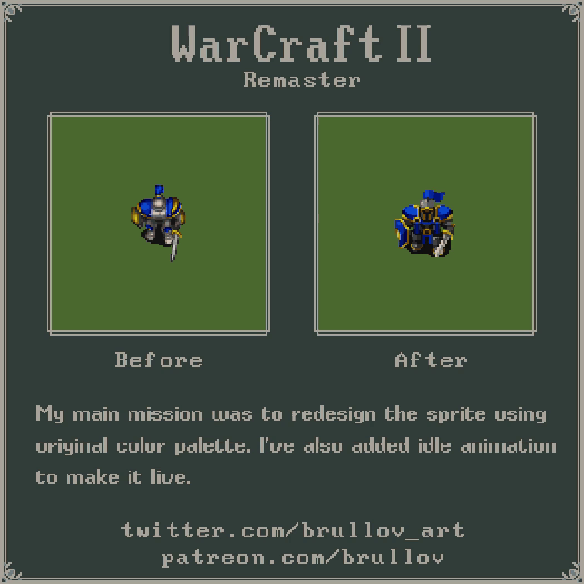

Tags: #gamedev #retrogaming #RTS #multiplayer

### Назначение

Этот файл содержит описание проекта на нормальном человеческом языке и используется как исходник для формирования ТЗ.

## Лирическое отступление

Сегодня хочу затронуть тему классических RTS - стратегий реального времени, в контексте мультиплеера и киберспорта. И затрагивать мы её будем на примере неувядающей классики.

Можно до посинения, с пеной у рта спорить кто является родоначальником жанра: Duna II или Herzog Zwei, кто является лучшим представителем золотой эры RTS: C&C-производные или игры от Blizzard, какая из версий Starcraft является вершиной эволюции киберспортивного RTS: вторая часть Starcraft или всё-таки Brood War, и кто, в конце концов, у кого украл орков?

Но, пожалуй, в одном сойдутся практически все, кто застал становление золотой эры RTS: Веха в мировом игрострое, безусловный шедевр мирового игропрома и одни из самых ярких представителей жанра, снискавший культовый статус —

**Warcraft II**

И именно с него начался массовый мультиплеер в том виде, в котором мы сейчас его знаем _(Да, я знаю, что C&C вышел чуть раньше)_. И что самое удивительное - до сих пор объединяет довольно внушительное комьюнити, которое активно гоняет по сети и даже регулярно устраивает турниры. А так-то оригинальной игре уже более 30 лет, и в киберспортивном плане от современных стандартов жанра она безнадёжно отстаёт: несбалансированные расы, ограниченный набор юнитов и их способностей, плоские одноуровневые карты и, как следствие всего этого - очень низкая вариативность геймплея, плюс устаревший UI, рассчитанный _(по сегодняшним меркам)_ на ~~задро~~ хардкорных игроков, отсутствие системы матчмейкинга и проблемы с сетевым подключением _(NAT)_, поддержка наблюдателей в зачаточном состоянии, не говоря уже об отсутствии реплеев в принципе...

И ведь были попытки омолодить старичка.

Первое, что приходит на ум - конечно **ремастер** от Blizzard. В основном коснулся только графической части _(тему качества её переработки тактично опустим)_, практически не затронув реально востребованные сообществом аспекты, ну, разве что, матчмейкинг ещё завезли и немного допилили интерфейс. Что самое интересное, как раз **та самая** старая, примитивная 2D графика и является одним из основных факторов, создающих тёплую ламповую атмосферу игры, которой Warcraft II до сих пор удерживает игроков _(Да, в прочем, и первой части это тоже касается)_. Возможно именно поэтому ремастер так и не взлетел, в отличие от куда более удачного ремастера Brood War, который ваяли куда более осмыслено. А фанаты как гоняли, так и продолжают гонять в старый добрый... Нет, не оригинал.

**War2Combat** - дорабатываемая путём реверс-инжиниринга оригинальная версия игры. Позиционируется, в первую очередь, именно как клиент для мультплеера, хотя и одиночное прохождение поддерживает. Парни проделали титаническую работы - выжали из оригинала всё, что только можно было: частично исправили проблемы с сетью, улучшили интерфейс, добавили реплеи и поддержку наблюдателей, пофиксили баги оригинала, обеспечили работу на современных ОС и реализовали целую пачку мелких утилит улучшающих UX в мультиплеере. Но проект упёрся в потолок, потолок ограничений оригинального движка - это всё тот же старый добрый Warcraft с его классическими ограничениями в игровых механиках, но в который стало играть немного комфортней. Для более радикальных изменений нужен уже свой движок, и, что самое интересное - он есть.

Проект **Wargus**. Это уже полноценная альтернативная реализация Warcraft II _(Warcraft I, кстати, у них тоже есть)_ со своим движком - Stratagus. Проект имеет очень долгую историю - аж с 1999 года, тогда еще под именем FreeCraft, выжил под натиском юристов Blizzard и дотянул до наших дней во всё ещё активном состоянии. В первую очередь, он всё-таки ориентирован на воссоздание оригинальной игры и её кампании, с существенно улучшенным UI/UX: высокие разрешения, поддержка широкоформатных мониторов, шейдеры для стилизации (например CRT или VHS) и улучшения качества спрайтовой графики, ралли-поинты, очереди заказа и приказов, автокаст и большие выделяемые группы юнитов и т.д. Во вторую - многопользовательская составляющая в нём тоже присутствует. А преимущество своего движка - он полностью развязывает руки в плане реализации игровых механик и позволяет воплотить в жизнь всё то, чего нехватает для абсолютного киберспортивного счастья.

Точнее мог бы. К сожалению, проект до сих пор откровенно сырой. Да, он позволяет играть против AI-сопериников, которые могут быть довольно сильными... когда не тупят. Да, он позволяет проходить кампании оригинальной игры... и даже не во всех миссиях крашится. И да, если вы всё-таки сможете достучаться друг до друга через интернет, он позволяет играть по сети... какое-то время, до того, как словите рассинхрон. Кодовая база с несколькими археологическими слоями легаси кода и полтора разработчика переменной степени активности с каждым годом делают надежды на доведение проекта до стабильного состояния всё более призрачными, к сожалению. Есть легенда, что Павел Загребельный _(Да-да, тот самый - Spintires)_ сначала потыкал палочкой в Wargus, прикинул объём требуемых изменений и...

...и запилил свой, с преферансом и куртизанками.

Проект **The Scouring** - формально никак не ассоциирующий себя с Warcraft, но это самый второй из всех возможных четвёртых Warcraft'ов, кто бы их не задумал делать - хоть сам Blizzard бы свой запилил _(если это, конечно, не тот, старый Blizzard)_. Это уже совсем современная реинкарнация в полноценном 3D, с RPG элементами, но явно прослеживаемой любовью к первоисточнику. Да, есть нюансы с балансом, разнообразием юнитов и вариативностью, но игра ещё только в раннем доступе и парни активно её допиливают, на всю катушку привлекая уже сложившееся комьюнити. Будем надеяться, что всё у них в итоге получится.

Но всё-таки... это не Warcraft. Тут можно провести аналогию — это как с переходом от первых двух Fallout'ов к третьему — игра вышла отличная, но это уже не **тот** Fallout.

И, всё, на этом варианты актуализации закончились. И, вроде, их не так уж и мало, но... не то?

А, собственно, что из результатов 30 летней эволюции жанра можно было бы применить к нашему ветерану, не ломая тёплую ламповую атмосферу классики? 

Но начнём, пожалуй, с устранения явных недостатков. В первую очередь, это конечно же

## Сеть

Последней _(до ремастера, конечно же)_ инкарнацией от Blizzard была BNE-версия, которая подарила возможность подключаться через Battle.net. Первую его версию конечно же. До этого играть можно было только по локальной сети и модему. Для подключения через интернет приходилось пользоваться обходными путями и эмулировать LAN между удалёнными узлами, пробрасывая между ними IPX-туннели _(да, поддержки стека TCP/IP тогда ещё не было)_. Поддержка Battle.net же стала глотком свежего воздух - подключение без применения сторонних утилит, лобби, а каналы и чат существенно упростили поиск соперников. В общем все те прелести, которые на тот момент уже имел Brood War, сыгравшие немаловажную роль в становлении последнего, именно как киберспортивной дисциплины.

Но сетевая архитектура Warcraft всё равно остаётся peer-to-peer, т.е. клиенты напрямую соединяются друг с другом, а сервер Battle.net обеспечивает только обмен IP-адресами, и в обмене трафиком между ними не участвует. Это не представляло проблемы пока большинство выходило в интернет через dial-up соединения. Но прогресс не стоял на месте, и вместе с повсеместным внедрением широкополосного интернета пришли домашние роутеры и NAT. NAT, позволяющий сразу нескольким компьютерам подключаться к интернету используя общий IP-адрес, но, в то же время закрывающий их от доступа извне. Т.е. он попросту ломал возможность прямого соединения между клиентами. Тут уже приходилось прибегать к различным ухищрениям вроде проброса портов или танцам с бубном вокруг UDP hole punching'а. Что работало, но не стабильно и не везде.

Brood War и третий Варкрафт тоже страдали от этой проблемы, окончательно же забороть её Близзарды смогли только с выпуском Starcraft II и специально разработанного под него Battle.net 2.0. Где задействовали уже гибридную схему:

1. Приоритетным оставили P2P соединение _(как наиболее эффективный вариант для RTS)_, при этом механизмы обхода NAT добавили уже на уровне клиента и сервера 
2. Если прямое соединение не удавалось, то трафик пускался через сервера Battle.net, которые выступали уже в качестве relay. Причём такое переключение возможно даже во время уже начавшейся игры - сервер теперь отслеживал состояние соединений и динамически пересобирал топологию, в случае необходимости.

Кроме того, для увеличения устойчивости добавили возможность переподключения к уже запущенной игре даже после вылета клиента - сама игровая сессия оставалась активной на сервере и при повторном подключении на клиенте происходила синхронизация состояний с остальными игроками _(что для RTS, с их lockstep-моделью синхронизации - не самая тривиальная задача)_.

И вот именно эти механизмы мы без сомнения позаимствуем. 

Дальше у нас, пожалуй самое ценное, что завезли в Battle.net 2.0:

## Система матчмейкинга

Её основная задача - автоматический подбор наиболее подходящих игроков, на основании таких критериев как, например:

- MMR (рейтинг игрока)
- Регион / пинг
- Время ожидания
- Режим игры _(1v1 / 2v2…)_
- Желаемые карты

Базовая идея - минимизировать разницу скилла между игроками. Однако с ростом времени ожидания подходящего соперника допустимый разброс MMR постепенно увеличивается, а вторичные ограничения ослабляются: например, если сначала приоритет отдаётся локальному региону, то со временем допускаются и более удалённые игроки. Там ещё задействуется куча полезных алгоритмов - например, защита от смёрфов _(сильных игроков прикидывающихся новичками)_ - но сейчас в подробности вдаваться не будем.

При этом старый добрый способ создать свою игру и позвать туда только определённых игроков никуда не делся - можно использовать и его.

Ну а раз уж мы выше определились, что всё-равно придётся вводить свой сервер, то это всё, конечно же, тоже забираем.

## Observers & Replays

В Warcraft II, если мы хотели просто посмотреть чей-то матч, то вариант был только один: подключаемся как обычный игрок, далее, чтобы свести возможность помешать реальным игрокам к минимуму, разрушаем все свои стартовые здания _(если есть)_, убиваем всех своих юнитов кроме одного, и прячемся им в кусты. Просим игроков дать нам свою видимость и отметить нас как союзника, чтобы те случайно не грохнули нашего последнего из Могикан _(тогда мы просто вылетим из игры)_. Зачастую просим настойчиво, т.к. игроки отвлекаются/забывают/некогда/"ты будешь подсказывать сопернику". В игры на 8 активных игроков _(FFA, 4v4...)_ вообще нельзя было зайти посмотреть - сказывалось ограничение на максимальное количество игроков. Для небольших же, и дуэльных карт, наоборот, приходилось в редакторе добавлять слоты для игроков-наблюдателей, что тоже не сильно радовало удобством.

Но, справедливости ради, стоит отметить, что на тот момент и потребности-то такой, как сейчас, в подобном функционале по большому счёту не было - ну кому в середине 90-х могла прийти в голову мысль, что матчи можно комментировать и, тем более, стримить? Тогда даже FPVOD'ы только-только зарождались, и то, в формате - постоять за спиной и заглядывать в монитор из-за плеча. А вот, с реплеями Близзарды просто не доработали - архитектура позволяла их реализовать.

Ладно, насчёт "не доработали" - шучу конечно, все мы задним умом сильны, а тогда жанр только становился - идея могла ещё просто не вызреть. Но насчёт технической возможности - абсолютно серьёзен: да, движок не поддерживал, но если перехватить команды, которыми обмениваются клиенты по сети...

Дело в том, Warcraft использует так называемую lockstep-модель: это когда на каждом клиенте выполняются абсолютно идентичные симуляции игрового мира, и сетевой обмен происходит не состояниями этих симуляций, а командами, которые игроки отдают своим юнитам _(идти, атаковать, строить и т.д.)_. Симуляции абсолютно детерминированы - получив одинаковые последовательности команд, они оказываются в полностью идентичных состояниях на всех клиентах. Что даёт интересный побочный эффект: если сохранить поток команд, отданных всеми игроками в ходе игры, и затем последовательно применить его к новой симуляции _(запущенной с теми же начальными условиями, что и оригинальный матч)_, можно пошагово воспроизвести весь ход игры... Да, by design во втором Warcraft была практически бесплатная возможность добавить поддержку реплеев.

Но для оригинального движка реализована она была только в фанатском War2Combat.

С механизмом разобрались. Осталось добавить отдельный интерфейс заточенный именно под просмотр, а не управление. Позволяющий просматривать такие данные как: что у кого в заказе, количество потраченных ресурсов, сколько юнитов потеряно и сколько они стоили в ресурсах, экономические показатели: количество рабочих, скорость и динамика добычи ресурсов и т.д. И мы получим вполне себе современный инструмент не просто для проигрывания реплеев, а для полноценного анализа игр.

Можно пойти ещё чуть дальше: если периодически _(например, раз в 30 секунд)_ сохранять полное состояние симуляции, то мы получаем ещё и возможность обратной перемотки состояния по этим ключевым кадрам. Кстати, именно так в Starcraft II реализован реконнект после вылета клиента: при повторном подключении он получает последний сохранённый слепок состояния симуляции и последующий поток команд - этого достаточно для того, чтобы догнать симуляцию до состояния, которое было в момент дисконнекта.

А теперь интересный момент - что будет если в систему просмотра реплеев направить не сохранённый поток, а команды матча идущего в настоящий момент? Правильно - искомая поддержка наблюдателей. 

Ну и раз это всё практически бесплатно, то кто мы такие, чтобы отказываться?

Итак, у нас уже есть _(точнее, мы уже определились, что хотим)_ основы основ, для киберспортивной мультиплеерной игры: гарантированное подключение, стабильное соединение и механизм поиска равных соперников, а ещё возможность просмотра и - что самое главное - анализа игр. Ключевое здесь - все эти доработки ни коим образом не влияют ни на игровые механики, ни на баланс, ни на какой-либо иной чувствительный аспект игры, изменение которого может ухудшить уже имеющийся пользовательский опыт - внедрять можно безболезненно.

А вот дальше пойдут компромиссы - теперь мы заходим на территорию той самой ламповости, и здесь придётся быть очень осторожными. Но нам нужно увеличить количество активных игроков _(надо же с кем-то играть)_, улучшить вариативность _(чтобы хотелось играть ещё)_ и добавить зрелищности _(иначе какой это киберспорт?)_. 

## UI/UX

Это не про красоту и удобство, как может показаться на первый взгляд. Для RTS - это, в первую очередь, про снижение когнитивной нагрузки. Когда пресловутые 7±2 _(а по некоторым данным даже 4±1)_ перегружены, мы забываем заказывать рабочих или отправлять их на добычу ресурсов, мы попадаем в саплай блоки и напрочь забываем про миникарту и производство.

На практике большинство значимых улучшений, решающих проблему перегрузки внимания лежат скорее на границе UI и игровой логики - изменение интерфейса почти всегда сопровождается делегированием части действий системе. И именно эта связка даёт основной выигрыш в снижении когнитивной нагрузки.

Все эти "оказуаливающие современные RTS" очереди строительства, заказов, команд и умные ралли-поинты, автоспеллы и механики управления большими группами юнитов - это как раз про освобождение когнитивного ресурса за счёт перекладывания рутинных действий на движок игры. А уж найти куда этот "избыток" применить всегда найдётся - будь то микроконтроль юнитов во время боя, или мультитаск на два-три одновременных очага харрасмента - что существенно повышает зрелищность игры. Плюсом получаем эффект снижения входного порога для новичков... да и, что уж душой кривить, олдтаймерам жизнь тоже облегчает - есть идеи какой средний возраст игроков во второй Warcraft? ;)

В качестве опорной точки берём вершину эволюции Blizzard-стайл RTS: Starcraft II _(опять, да)_ - думаю, сложно будет найти другого киберспортивного представителя, полировке интерфейса и механик управления, которого, было бы уделено сопоставимое количество внимания, средств и усилий. Всё-таки национальный вид спорта в Корее.

> _Кстати, интересно было бы посмотреть на результат эксперимента: во что будет играть больше народа - в первый Warcraft с интерфейсом и механиками управления Starcraft II или во второй Starcraft, но с интерфейсом и механиками Warcraft I?_

### Панель управления

Тут всё стандартно по сегодняшним меркам:

- Широкоформатная горизонтальная, расположена снизу. Возможно чуть более компактная по вертикали, чем SC2.
- Миникарта слева, панель команд справа, по центру блок для отображения информации о выделенных юнитах и работы с группами.
- Над миникартой иконки для выбора незанятых рабочих и всех боевых юнитов, с указанием кол-ва, опциональный таймер.
- Рядом с миникартой кнопки для изменения режимов отображения: союзники/противник, отключение отображения ланшафта/юнитов.
- Информация о ресурсах дублируется над миникартой. Стандартное расположение в правом верхнем углу экрана тоже оставляем - оба варианта опциональны и отдаются на откуп игроку. _(Было много копий сломано на эту тему, основная мысль: два самых важных информационных блока разнесены на диаметрально противоположные стороны - это мешает)_
- Опциональные иконки контрол-групп над центральным блоком с указанием количества юнитов. Опционально можно делать некликабельными, для устранения мискликов.

### Горячие клавиши

Во-первых, полностью настраиваемые. Команды можно назначать как клавиатуру, так и кнопки мыши.

Во вторых, добавляем опциональный режим **grid hotkeys** - это когда каждая команда привязывается не к своей букве _(`'P'` - peon, `'B'` - barracks, etc.)_, а к фиксированной позиции в сетке панели управления, соответствующей расположению клавиш на клавиатуре _(например, `QWERT` - первый ряд / `ASDF` - второй и т.д.)_. Это даёт дополнительное снижение когнитивной нагрузки, т.к. подключается мышечная память - игрок ориентируется по позиции конопок - вместо запоминания названия команд. Опять же - опционально.

### Миникарта

Миникарта тоже эволюционировала - от простейшего "индикатора положения" в Warcraft до полноценного инструмента управления вниманием в Starcraft II _(что, впрочем, не мешает нам упорно забывать на неё смотреть)_.

### Контрол-группы

- Контрольные группы на неограниченное кол-во юнитов, с группировкой по типу и возможностью индивидуального доступа к каждому юниту. Агрегатирование команд на спеллы разных юнитов в группе в общую палитру
- Мультивыбор зданий
- Очереди заказов с возможностью произвольно удалять элементы из них
- Очереди постройки
- Очереди команд (move, attack+move, patrol еtc.)
- Умные ралли-поинты (куда выходят вновь создаваемые юниты) на точку на карте, юнит или ресурсы. Возможность задать очередь ралли-поинтов, в том числе через attack+move
- autospell, в том числе автопочинка для рабочих
- Хоткеи для переключения камеры (настраиваемые)
- Отображение сетки при строительстве зданий (опционально)

-------
А талантливые художники, безусловно, есть:

 
 ------

- Повышение QoL и снижение когнитивной нагрузки при управлении
- Сетевая подсистема/match making
- Добавление новых механик, юнитов. Балансировка

## Maps
## Editor
## Units
- Сборные
- Разведка
- Многоразовые Dwarfs-сапёры
- Юниты из WC1:Remastered
## Механики
- Микроменеджмент
- Лес
- Ограничение количества рабочих в шахте
- Стартовое количество рабочих и быстрая постройка первого TH
- Скверна
- Транспортировка (по воздуху, магией)
- Атака из транспорта
- Микро связкой транспорт+юнит (drop-attack-pullup)
- Починка осадных орудий
- Сплэш с отбросом юнитов
- Line throught acctack для осадных орудий
- Steering behavior
- Mineral walk
- Muta-stack
- Щиты 
- Размеры юнитов (например увеличить огров)
- Болас - замедление наземный и приземление летающих юнитов 
- Unit size depending supply
- Атака с подшагиванием
- Снайперские выстрелы (аля-госты)
- блокировка видимости стенами, лесом и камнями. Вышки для вижна.
- highgrounds
- charge
- закопка/засады
- forcefields-like mgic
## Режимы игры
## Arena (Balancing tool)

## AI
- Слои данных для скармливания AI
